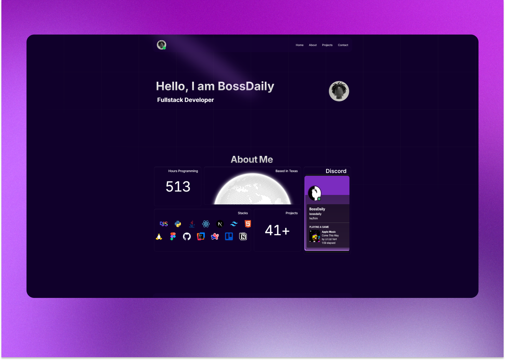

<div align="center" >
  
  <h1>bossdaily.dev</h1>
  <p>My personal portfolio website built with Next.js, TypeScript, and TailwindCSS</p>
</div>

<div align="center">
  
</div>

## 🚀 Features

- Responsive design
- Real-time Discord presence
- Dynamic GitHub integration
- WakaTime statistics
- Project showcase
- Animated UI components

## 🛠️ Tech Stack

- Next.js 14
- TypeScript
- TailwindCSS
- [Acternity UI](https://21st.dev/aceternity), [Magic UI](https://21st.dev/magicui) and [shadcn UI](https://21st.dev/shadcn) 
- Framer Motion
- React Use Lanyard
- Various APIs (Discord, GitHub, WakaTime)

## 📦 Installation

1. Clone the repository:
```bash
git clone https://github.com/bossdaily/bossdaily.dev.git
```

2. Install dependencies:
```bash
cd bossdaily.dev
npm install
```

3. Create a `.env` file in the root directory:
```bash
cp .env.example .env
```

4. Add your WakaTime API key to the `.env` file:
```bash
WAKATIME="your-api-key"
```

5. Update the configuration:
Edit `config.ts` with your personal information:
- Discord ID
- GitHub username
- Projects
- Skills/Languages

6. Run the development server:
```bash
npm run dev
```

## 🌐 Deployment

The site is optimized for deployment on Vercel. To deploy:

1. Push your repository to GitHub
2. Import the project to Vercel
3. Add your environment variables
4. Deploy!

## 📝 License

MIT License - feel free to use this code for your own portfolio!

## 🤝 Contributing

Contributions, issues, and feature requests are welcome!

## 📞 Contact

- GitHub: [@bossdaily](https://github.com/bossdaily)
- Discord: Contact through my [website](https://bossdaily.dev)
